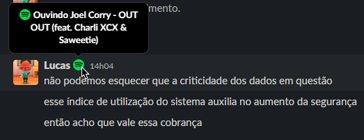

# 🎵 slack-spotify
Let your co-workers know what you're listening to!

  

## Installation

Before starting, make sure you have both [Node.js and npm](https://nodejs.org) properly installed.

1. Clone this repository or [click here](https://github.com/doceazedo/slack-spotify/archive/refs/heads/main.zip) to download it.
2. Run `yarn` or `npm install` to install the dependencies.
3. Create a [Slack app](https://api.slack.com/apps) with the `users.profile:write` user scope and grab an OAuth token for your workspace (at the **OAuth & Permissions** page).
4. Create a [Spotify app](https://developer.spotify.com/dashboard/login) and grab your [refresh token](https://benwiz.com/blog/create-spotify-refresh-token/) with the `user-read-currently-playing` scope.
5. Optionally, add the [:spotify:](assets/spotify.png) emoji to your workspace.
6. Rename the ".env.example" file to ".env" and fill it in.
    - The emojis may be any [valid Slack shortcodes](https://emojipedia.org/musical-notes/#:~:text=%3Anotes%3A%20(Github%2C%20Slack)), including custom ones.
    - You can get the code for the currently available languages [here](#translations).
    - Setting `FILTER_BADWORDS` to true will replace bad words in song titles with asterisks.

## Usage

Run `yarn start` or `npm run start` and you're good to go, yet you could use something like [pm2](https://npmjs.com/package/pm2) for more control over the application.

## Translations

List of currently available languages:

| Language                | Code  |
|-------------------------|-------|
| English (United States) | en_US |
| Portuguese (Brazil)     | pt_BR |

If you'd like to submit a translation, you can fork this repository and follow these steps:

1. Duplicate the "src/lang/en_US.ts" file and rename it to match your [language ISO code](http://www.lingoes.net/en/translator/langcode.htm). If your code have four letters, use an underscore intead of a hyphen. For example, the "pt-BR" language file would be called "pt_BR.ts".
2. In your newly created file, replace the variable name with your language ISO code again.
3. In the "src/lang/index.ts" file, import your language and add it to the `lang` array. Make sure these are added in alphabetical order.
4. Finally, translate the strings in the file you created.
